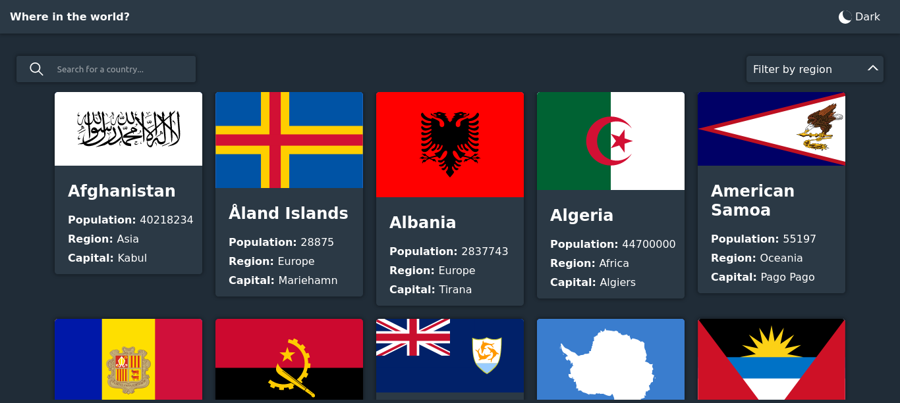
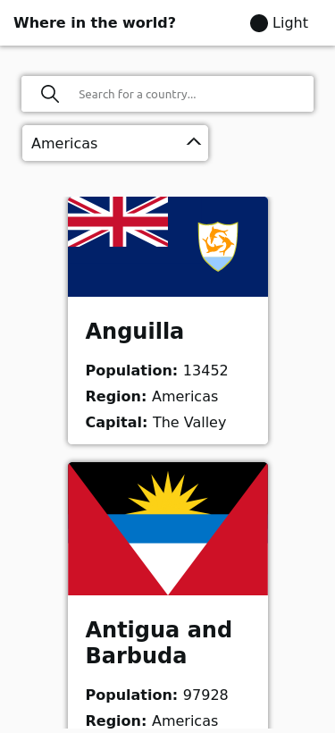

# Frontend Mentor - REST Countries API with color theme switcher solution

This is a solution to the [REST Countries API with color theme switcher challenge on Frontend Mentor](https://www.frontendmentor.io/challenges/rest-countries-api-with-color-theme-switcher-5cacc469fec04111f7b848ca). Frontend Mentor challenges help you improve your coding skills by building realistic projects. 

## Table of contents

- [Overview](#overview)
  - [The challenge](#the-challenge)
  - [Screenshot](#screenshot)
  - [Links](#links)
  - [Built with](#built-with)
  - [Useful resources](#useful-resources)
- [Author](#author)

## Overview

### The challenge

Users should be able to:

- See all countries from the API on the homepage
- Search for a country using an `input` field
- Filter countries by region
- Click on a country to see more detailed information on a separate page
- Click through to the border countries on the detail page
- Toggle the color scheme between light and dark mode *(optional)*

### Screenshot

### Links

- Live Site URL: [visit](https://whereinglobe.netlify.app/)

## My process
its need some ui fixes

### Built with

- Flexbox
- CSS Grid
- Mobile-first workflow
- [React](https://reactjs.org/) - JS library
- [Styled Components](https://styled-components.com/) - For styles

### Useful resources

- [SVGRepo](https://www.svgrepo.com) - Browse 300.000+ SVG Vectors and Icons
Explore, search and find the best fitting icons or vectors for your projects using wide variety vector library. Download free SVG Vectors for commercial use.

## Author

- Frontend Mentor - [@DipankajSingh](https://www.frontendmentor.io/profile/DipankajSingh)
- instagram - [its_dipankaj](https://www.instagram.com/its_dipankaj)

